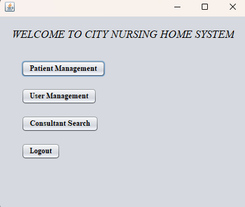
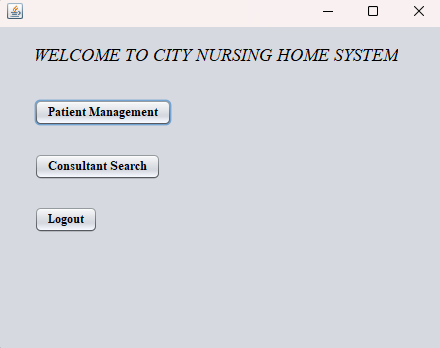
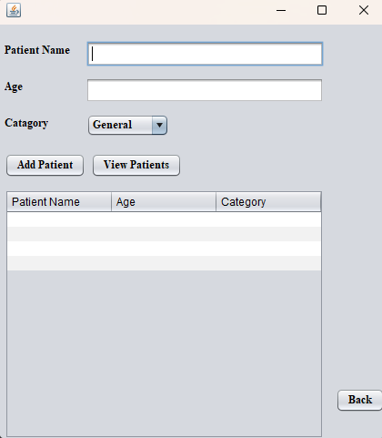
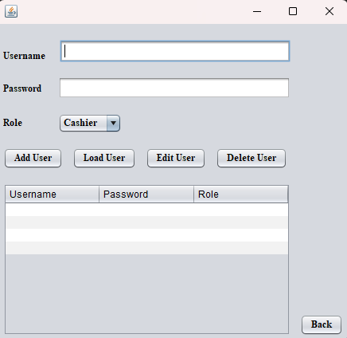
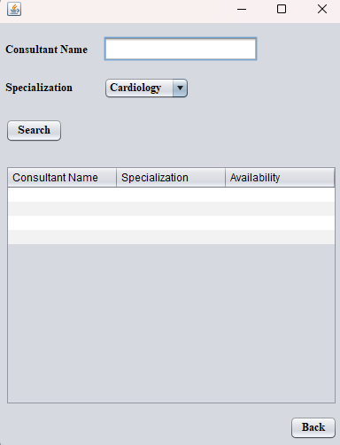

# 🏥 Hospital Management System  

A Java-based **GUI Hospital Management System** developed using **NetBeans**.  
The system implements **file handling** to manage user, patient, and consultant data.  
It incorporates **OOP concepts** like encapsulation and inheritance to separate roles and responsibilities.

---

## 🚀 Features & Classes  

### **LoginForm**
- Handles user authentication using username and password.  
- Connects to the `User` class to verify credentials.  

### **User**
- Represents a system user with details like username, password, and role.  
- Provides methods to access the dashboard, retrieve user info, and perform role-specific tasks.  
- Specialized roles:  
  - `Manager`  
  - `Cashier`  

### **ManagerDashboard & CashierDashboard**
- Assign functionalities based on user roles.  
- **ManagerDashboard**: access to `UserManagement`, `PatientManagement`, `ConsultantSearch`.  
- **CashierDashboard**: access to `ConsultantSearch` and `PatientManagement`.  

### **UserManagement**
- Allows Managers to add, modify, and remove users.  
- Manages instances of the `User` class.  

### **PatientManagement**
- Allows Cashiers to view current patient records and add new patients.  
- Manages instances of the `Patient` class.  

### **Patient**
- Represents a patient with properties like name, age, and category.  
- Contains methods for reading and saving patient records to files.  

### **ConsultantSearch**
- Allows Manager and Cashiers to search for consultants based on availability and specialization.  

### **Consultant**
- Represents a consultant with attributes like availability, specialization, and name.  

---

## 🛠️ Tech Stack  
- **Language:** Java  
- **IDE:** NetBeans  
- **Data Handling:** File handling  
- **GUI:** Java Swing (drag-and-drop in NetBeans)  

---

## 📸 Screenshots

**Login Form**  
  

**Manager Dashboard**  
  

**Cashier Dashboard**  
  

**Patient Management**  
  

**User Management**  

**Consultant Search**  

